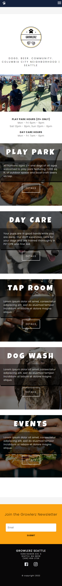
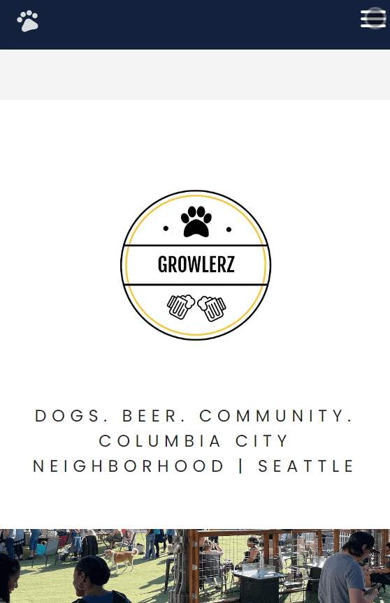
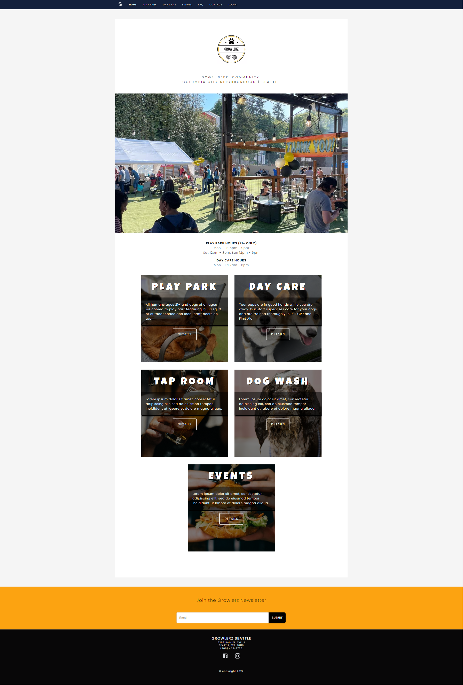
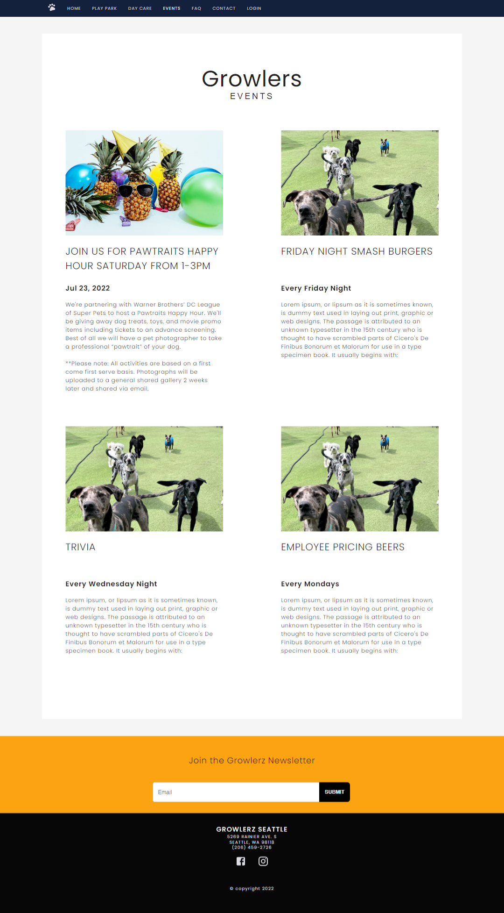
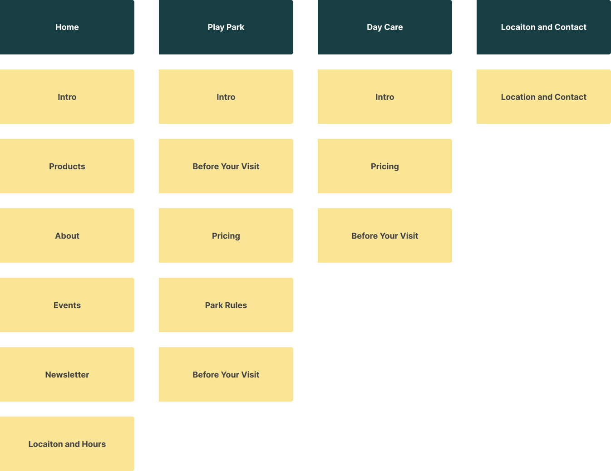
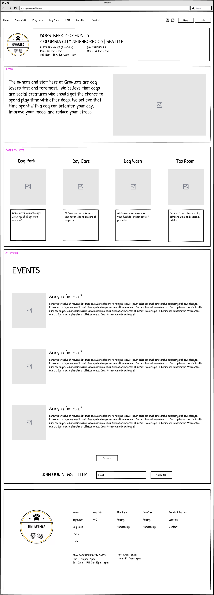
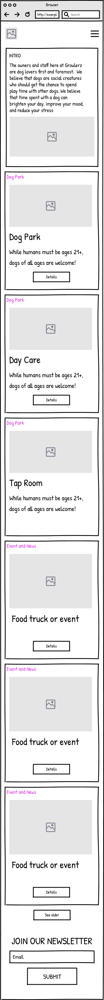
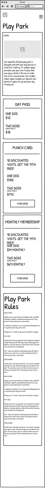
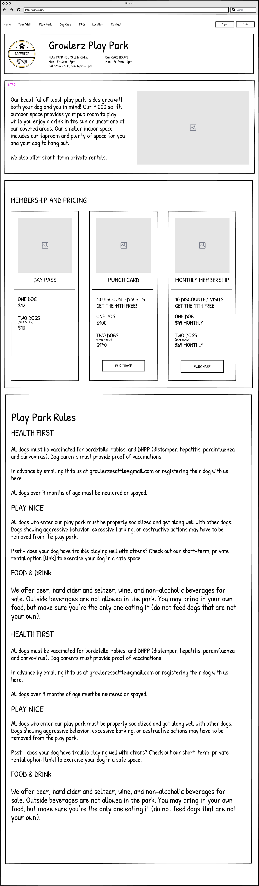

# Growlers Seattle Local Commerce Site

The site is to serve as a business website for a private dog park, Growlerz Seattle. The site has been deployed as a proof-of-concept for the owners, and will receive a final approval before production. The need for the site, is a simple interface between the business and visitors. The owners needed a easy way of adding events, changing prices, notifying customers, and updatng hours that their current provider Wix does not.

## User Stores

- As a user of the Growlerz Seattle commerce site
  - I would like the app to inform me of business details, products, and relevant information. In order of priority:
  1.  Product and Pricing
  2.  Things to know before visiting
  3.  Events and Food truck
  4.  Taproom
  5.  Hours and Location
  6.  Park Rules and Pricing
  7.  Misc
  - I would like the app to be responsive on both mobile and desktop.
  - I would like to easily find
  - I would like to know if small dogs are separated from large dogs.
  - Would like to see the layout of the dog park and photos.
  - Would like to know are humans welcome (with/without dogs?)

Acceptance Criteria

1. The website is responsible for mobile and desktop
2. Owner approves of the design and content
3. Products are contained in their own components.
4. Owners and update events and details via google sheets

## API

A weather API was used for the play park page.
A sheetsdb API was implemented as a in-between for google sheets where the owners update their content and interfacing with the website.

## Screenshots

## Wireframes

## Dependancies

Materials UI https://mui.com/
React Router Dom

# Inspiration

https://www.cadetpet.com/dog-basics/must-visit-indoor-dog-parks

## Colors

https://coolors.co/palette/000000-14213d-fca311-e5e5e5-ffffff

--black: #000000;

--oxford-blue: #14213d;

--orange-web: #fca311;

--platinum: #e5e5e5;

--white: #ffffff;

## Tasks

- Create React Router

## Obstacles

- Started using Materials IU to cut down work on effects. Took a long time to figure out, but researching online, I realized the react-router-dom's Link added an underline to the Material UI's button. I was targeting the button, but instead had to target the Link to remove the underline.
- I had problems with deploying to Netilfy. In the future I'll deploy with an empty project, then constant deploys. To remedy this project, I created a new one and moved components by components.
- I need to be better planning CSS

## Things Learned

- I dislike the amount of time and work that goes into design.
- Using css white-space: pre-line to format JSON text.
- Defining global variables for CSS
